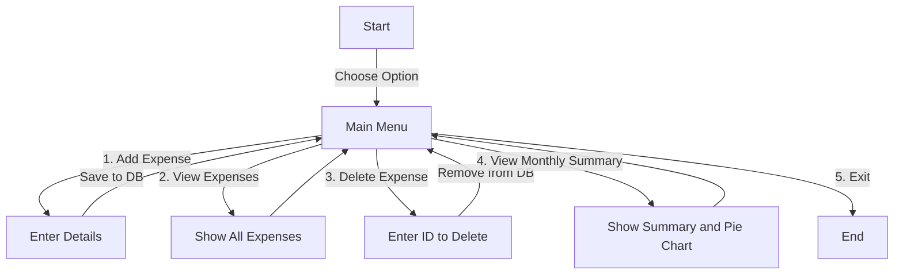

# Expense Tracker

## Overview
This is a simple Expense Tracker application built using Python and SQLite. It allows users to add, view, and delete expenses, view a monthly summary, and visualize expenses using a pie chart.

## Features
✅ Add expenses with amount, category, description, and date.
✅ View all recorded expenses.
✅ Delete an expense by ID.
✅ View a monthly summary of expenses.
✅ Pie chart visualization of expenses for better insights.

## Installation
1. Clone the repository:
   ```sh
   git clone https://github.com/yourusername/expense-tracker.git
   cd expense-tracker
   ```
2. Create a virtual environment and activate it:
   ```sh
   python -m venv venv
   source venv/bin/activate  # On Windows use `venv\Scripts\activate`
   ```
3. Install dependencies:
   ```sh
   pip install -r requirements.txt
   ```
4. Run the script:
   ```sh
   python main.py
   ```

## Usage
1. Run the script and choose an option from the menu.
2. Enter details when prompted.
3. View expenses and analyze your spending patterns.

## Flowchart


## Future Enhancements
- Add user authentication.
- Export expense reports in CSV format.
- Implement a web-based UI for better accessibility.
